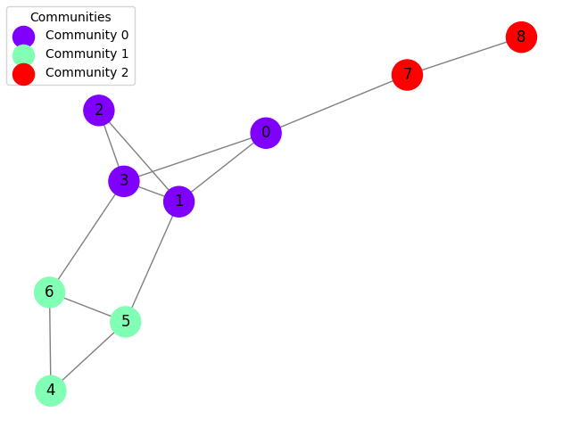

<div align="center">
   

   <strong>rapid evolutionary multi-objective community detection algorithms</strong>


[](https://pypistats.org/packages/re_mocd)


<hr>

</div>

> [!NOTE]  
> **This project is in its early stages.** Performance and results may not be optimal yet.

## Overview  

**re-mocd** is a Rust-based library designed for efficient and high-performance community detection in graphs. By leveraging the speed and memory safety of Rust, the project aims to handle large-scale graphs while addressing limitations in traditional algorithms, such as Louvain.   

---

## Installation  

### Via PyPI  

Install the library using pip:  
```bash
pip install re-mocd
```

---

## Usage  

Using **re-mocd** with a `networkx.Graph()` is simple. For example:  

```python
import networkx as nx 
import re_mocd

# Create a graph
G = nx.Graph([
    (0, 1), (0, 3), (0, 7), 
    (1, 2), (1, 3), (1, 5), 
    (2, 3), 
    (3, 6), 
    (4, 5), (4, 6), 
    (5, 6), 
    (7, 8)
])

# Pareto envelope-based selection algorithm II (PESA-II) 
partition = re_mocd.pesa_ii(G, debug=True)

# Non-Dominated Sorting Genetic Algorithm 2 (NSGA-II)
partition = re_mocd.nsga_ii(G, debug=True)

# You can check the fitness value of the partition
# returned by the algorithm using:
mod = re_mocd.fitness(G, partition)
```
<!--

### Examples  

- [Plotting Example](tests/python/example.py)  
- [Comparison with Other Algorithms](tests/python/main.py)  
- [Modularity ring problem](tests/python/benchmarks/ring.py)
- [Single file test](tests/python/benchmarks/single.py)

-->

---

<center>  
  
</center>  

---

### Contributing  

Contributions are welcome! Feel free to submit issues, feature requests, or pull requests to improve the project.  

**License:** GPL-3.0 or later  
**Author:** [Guilherme Santos](https://github.com/0l1ve1r4)  
